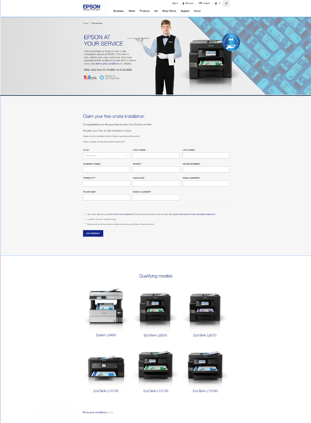

# optimum-claim

## Table of Contents
1.  [**Project Goals**](#project-goals)
    - [**Design choices**](#design-choices)

2. [**Technologies used**](#technologies-used)

3. [**Testing**](#testing)

### Project Goals

To create a Landing Page for the Client (Epson) regarding Optimum Claim, using HTML, Epson framework CSS for the ZA market (South Africa). 

### Design Choices

XD Links can be found here:
<a href="https://xd.adobe.com/view/b0ff21cd-38bc-4b40-a77d-329b384bf013-e5ac/specs/?featureset=fullscreenScaleToFit" target="_blank">Desktop</a>

### Screenshot of the page (This page is no longer live)
- Here are the screenshots for Desktop: 
    

     
    

## Technologies and Code Used

- This project uses HTML, CSS and JavaScript programming languages.
- [Epson Framework CSS](https://www.epson.co.uk/)
    - The project uses **Epson Framework CSS** .
- [Visual Studio Code](https://code.visualstudio.com/) 
    - Developer used **Visual Studio Code** to create the Landing page. 
- [XD Link](https://helpx.adobe.com/xd/help/share-designs-prototypes.html)
    - All of my images used in the Landing page came from the XD Link

## Testing 

Testing information can be found in separate [testing.md](testing.md) file as well as [BrowserStack](https://www.browserstack.com). 

## Credits

### Content

- All text in this project was written by the developer.

#### Disclaimer

Thank you for taking your time to read this. 

Afra. 